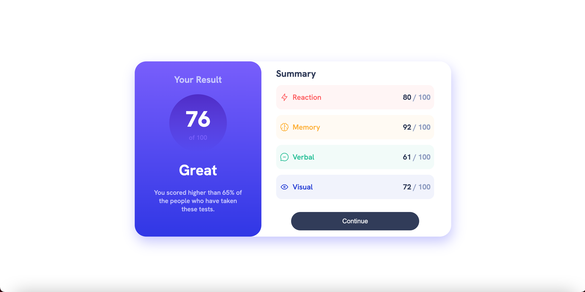
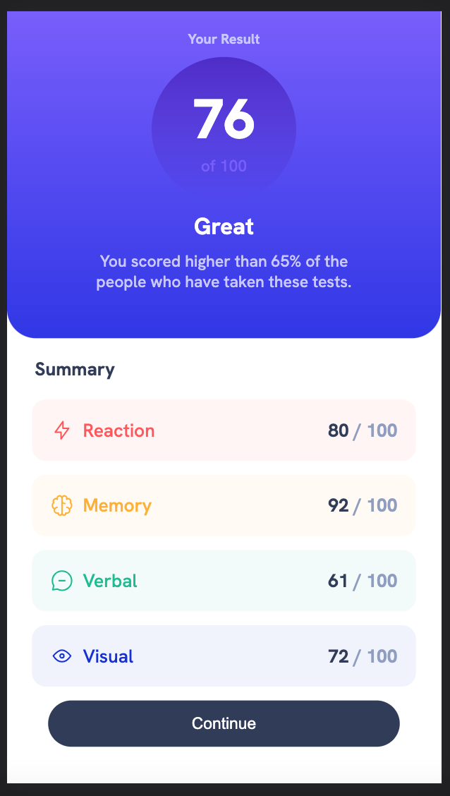

# Frontend Mentor - Results summary component solution

This is a solution to the [Results summary component challenge on Frontend Mentor](https://www.frontendmentor.io/challenges/results-summary-component-CE_K6s0maV). Frontend Mentor challenges help you improve your coding skills by building realistic projects. 

## Table of contents

- [Overview](#overview)
  - [The challenge](#the-challenge)
  - [Screenshot](#screenshot)
  - [Links](#links)
- [My process](#my-process)
  - [Built with](#built-with)
  - [What I learned](#what-i-learned)
  - [Continued development](#continued-development) 
- [Author](#author)

## Overview

### The challenge

Users should be able to:

- View the optimal layout for the interface depending on their device's screen size
- See hover and focus states for all interactive elements on the page (Continue button).

### Screenshot





### Links

- Solution URL: [Add solution URL here](https://github.com/DevMedic11/fem-results-summary-v2.gitm)
- Live Site URL: [Add live site URL here](https://stately-paletas-e806ee.netlify.app/)

## My process

### Built with

- Semantic HTML5 markup
- CSS custom properties
- Flexbox
- Mobile-first workflow
- [React](https://reactjs.org/) - JS library

### What I learned
  --This was my first time endeavoring into .json data. After figuring out the proper file structure so my HTML could find the data on load, writing a function that relies on that data to design the module was the next task. Its a bit clunky, but it worked!
  --I also wanted to  really focus on designing for mobile first. Which left me with repetitive media queries. By the end i figured out how to trim what was being changed between sizes, but im sure theres a better way.

```js
 function selectColor( category ){
    let color;
    switch(category){
      case "Reaction": 
        color= 'hsl(0, 100%, 67%)';
      break;
      case "Memory":
        color= 'hsl(39, 100%, 56%)';
      break;
      case "Verbal":
        color = 'hsl(166, 100%, 37%)';
      break;
      case "Visual":
        color= 'hsl(234, 85%, 45%)';
    }
    return color;
  }

  function selectBackground( category ){
    let color;
    switch(category){
      case "Reaction": 
        color= 'hsla(0, 100%, 67%, .06)';
      break;
      case "Memory":
        color= 'hsla(39, 100%, 56%, .06)';
      break;
      case "Verbal":
        color = 'hsla(166, 100%, 37%, .06)';
      break;
      case "Visual":
        color= 'hsla(234, 85%, 45%, .06)';
    }
    return color;
  }
```
### Continued development

Some of the font size inconsistencies and spacings bug me. Maybe ill come back and tweak things. 

## Author

- GitHub - [DevMedic11](https://github.com/DevMedic11)
- Frontend Mentor - [@DevMedic11](https://www.frontendmentor.io/profile/DevMedic11)

